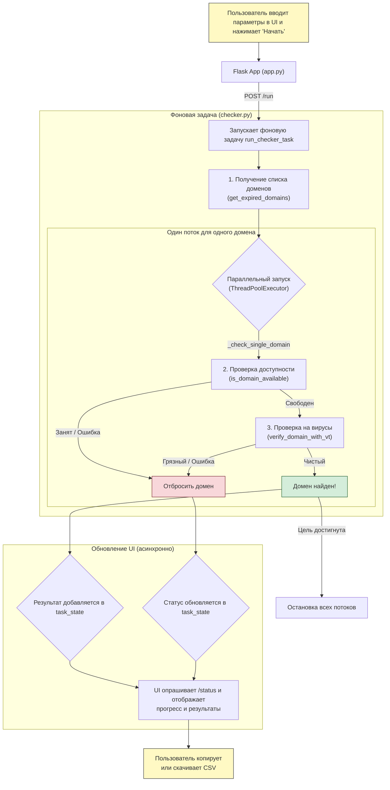

# Domain Checker

Высокопроизводительный и надежный инструмент для автоматического поиска и проверки доменных имен. Он получает списки недавно освободившихся доменов с [expireddomains.net](https://www.expireddomains.net/), параллельно проверяет их доступность через WHOIS и анализирует на вредоносное ПО с помощью VirusTotal API.

## Основные возможности

- **Параллельная обработка**: Запускает проверку доменов в несколько потоков (`multi-threading`), что значительно ускоряет процесс на больших списках. Количество потоков настраивается в интерфейсе.
- **Оптимизированный анализ VirusTotal**: Вместо фиксированного ожидания, приложение использует умный механизм опроса (`polling`). Оно периодически проверяет готовность отчета, что сокращает время ожидания до минимума.
- **Надежная проверка WHOIS**: Улучшенная обработка ошибок при проверке доступности домена. Кратковременные сетевые сбои или блокировки со стороны WHOIS-серверов больше не прерывают весь процесс, а корректно обрабатываются.
- **Гибкая конфигурация**: Позволяет использовать как URL с фильтрами из `config.ini`, так и вставлять временный URL прямо в веб-интерфейсе для разовых проверок.
- **Детальный мониторинг**: В реальном времени показывает не только общий прогресс, но и статус проверки каждого домена в отдельности (`WHOIS`, `VirusTotal`, `ожидание` и т.д.).
- **Эффективная остановка**: Работа останавливается сразу после нахождения заданного количества доменов, не тратя время на лишние проверки.
- **Экспорт результатов**: Найденные домены можно не только скопировать, но и скачать в виде `CSV-файла` для дальнейшей обработки.

## Требования

- Python 3.8+
- pip

## Установка

1.  **Клонируйте репозиторий:**
    ```bash
    git clone https://github.com/wov27/domain_cheker.git
    cd domain_cheker
    ```

2.  **Создайте и активируйте виртуальное окружение:**
    -   **macOS / Linux:**
        ```bash
        python3 -m venv venv
        source venv/bin/activate
        ```
    -   **Windows:**
        ```bash
        python -m venv venv
        .\venv\Scripts\activate
        ```

3.  **Установите зависимости:**
    ```bash
    pip install -r requirements.txt
    ```

## Настройка

Перед первым запуском необходимо создать и настроить конфигурационный файл.

1.  **Создайте файл `config.ini`**, скопировав `config.ini.example`:
    ```bash
    cp config.ini.example config.ini
    ```

2.  **Откройте `config.ini` и вставьте ваши данные:**

    ```ini
    [VARS]
    # 1. URL с expireddomains.net по умолчанию
    # Зайдите на сайт, настройте фильтры (например, только .com, без цифр и дефисов)
    # и скопируйте сюда получившийся URL из адресной строки браузера.
    # Этот URL будет использоваться, если в веб-интерфейсе поле URL останется пустым.
    EXPIRED_DOMAINS_URL = "https://www.expireddomains.net/..."

    # 2. Ваш API-ключ от VirusTotal
    # Его можно найти в личном кабинете на сайте VirusTotal.
    VIRUSTOTAL_API_KEY = "YOUR_VIRUSTOTAL_API_KEY"

    # 3. Cookies для доступа к expireddomains.net
    # Нужны для аутентификации. Их нужно взять из вашего браузера после логина на сайте.
    # - Откройте инструменты разработчика (F12)
    # - Перейдите на вкладку "Application" (Chrome) или "Storage" (Firefox)
    # - Найдите раздел Cookies -> https://www.expireddomains.net
    # - Скопируйте значения для ключей "ExpiredDomainssessid" и "reme".
    # ВАЖНО: Если в значении cookie есть символ '%', его нужно удвоить (%%).
    SESSION_ID = "YOUR_SESSION_ID"
    REME_COOKIE = "YOUR_REME_COOKIE"
    ```

## Запуск

После установки и настройки запустите веб-приложение:

```bash
python app.py
```

Сервер будет доступен по адресу `http://127.0.0.1:5001`. Откройте эту ссылку в браузере.

## Использование

1.  Откройте `http://127.0.0.1:5001` в браузере.
2.  **Настройте параметры проверки:**
    - **Количество доменов**: Сколько чистых доменов вы хотите найти.
    - **Количество потоков**: Сколько доменов проверять одновременно (оптимально 5-10).
    - **URL для парсинга**: Оставьте пустым для использования URL из `config.ini` или вставьте новый для этой конкретной сессии.
3.  Нажмите **"Начать проверку"**.
4.  Наблюдайте за процессом:
    - **Статус**: Общая информация о ходе выполнения.
    - **В обработке**: Детальный лог по каждому домену, который проверяется в данный момент.
    - **Результаты**: Список найденных чистых доменов со ссылками на отчет VirusTotal.
5.  Вы можете остановить проверку в любой момент кнопкой **"Стоп"**.
6.  Когда нужные домены найдены, воспользуйтесь кнопками **"Скопировать все"** или **"Скачать CSV"**.

## Схема работы



## Структура проекта

```